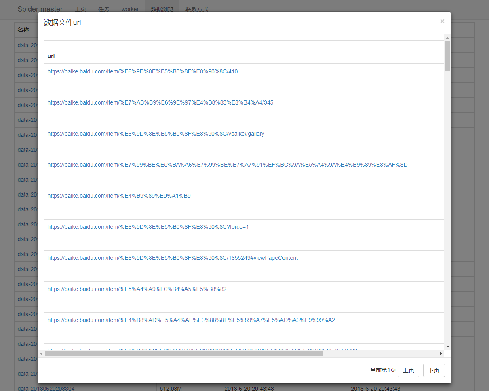

# spider
首先spider是一个分布式的网络数据抓取系统，根据逻辑分为两种角色：master、worker。

master负责维护任务，调度任务，下发url给worker，处理worker上报的数据。
 任务通过专有的DSL(领域特定语言)定义抓取逻辑，提交给master。
任务按照抓取逻辑分为指定数据抓取和镜像克隆，指定数据抓取是只抓取我们关心的站点页面；镜像克隆是抓取站点所有页面。

定义任务可以通过xml，这个目前唯一的方式，因为只实现了基于xml的dsl解析。目前xml可以参考下面示例，这个例子定义了抓取美团所有城市所有分类的店铺列表页。

worker根据任务的负载量，从master拉取url，然后抓取这些url的内容，最后上报给master。
worker工作非常单纯，专注于最大努力地从url得到数据。

## 编译
命令： 
mvn -f spider-build/pom.xml -DskipTests clean package  
命令执行后，会生成发布文件：spider-master/target/spider-master-verion-bin.zip和spider-worker/target/spider-worker-verion-bin.zip

## 运行
将编译之后得到的zip包解压，执行 bin/run.bat，这是window的脚本。linux下可参考。

## 其它文档
[计划](doc/计划.md) 
[数据结构](doc/数据结构.md) 

## 功能模块
spider主要包括：任务、worker、数据 模块。

### 任务模块

### worker模块

### data模块
数据文件列表

数据文件中的数据列表

